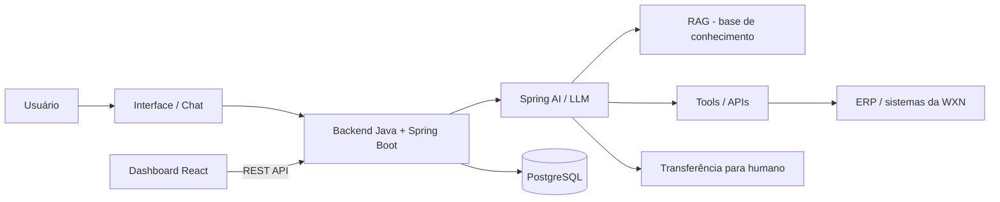

# WXN Chatbot

Fundação técnica do projeto de atendimento automatizado (chatbot / agente de
IA) para a **WXN Tecnologia** — Projeto 3, Computação, CESAR School.

> **Nesta etapa (Semana 05)** o objetivo foi montar o ambiente de
> desenvolvimento e de deploy: repositório, backend, frontend e banco de
> dados conversando entre si. O chatbot em si — regras de negócio, IA, RAG,
> integração com o ERP da WXN — **ainda não existe** e será construído nas
> próximas semanas. Veja [Próximos passos](#próximos-passos).

## Sobre o projeto

A WXN Tecnologia é uma software house que atende empresas com soluções SaaS
integradas a ERPs. O desafio proposto ao grupo é criar uma solução de
atendimento automatizado capaz de conversar com usuários, responder dúvidas,
consultar sistemas, manter contexto, transferir casos complexos para um
atendente humano e expor tudo isso em um dashboard para gestores e
atendentes.

Este repositório é o **monorepo** do projeto: backend, frontend e
documentação técnica vivem juntos aqui.

## Arquitetura

Visão de longo prazo do sistema (a maior parte ainda não implementada):



O que **já existe** hoje, funcionando de ponta a ponta, é o caminho
`Dashboard React → REST API → Spring Boot → PostgreSQL` reduzido ao mínimo:
o frontend chama `GET /api/health`, o backend responde e comprova que está
de pé e conectado ao banco. Tudo relacionado a IA (retângulos `AI`, `RAG`,
`TOOLS`, `ERP`, `H` no diagrama) é arquitetura planejada, não código.

## Tecnologias

| Camada | Tecnologia | Observação |
|---|---|---|
| Backend | Java 21 (LTS) + Spring Boot 4.1 + Maven | Gerado a partir do Spring Initializr oficial em 31/08/2026 |
| Frontend | React 19 + TypeScript + Vite | `npm create vite@latest -- --template react-ts` |
| Banco de dados | PostgreSQL | Local em dev; [Neon](https://neon.com/) recomendado para a nuvem — ver `docs/deploy.md` |
| Versionamento | Git + GitHub | Monorepo, fluxo `feature/* → develop → main` |

Versões exatas ficam fixadas em `backend/pom.xml` (Spring Boot, via o
`spring-boot-starter-parent`) e `frontend/package.json` (React, Vite,
TypeScript) — consulte esses arquivos para os números precisos a qualquer
momento, em vez de confiar só nesta tabela.

Deliberadamente **fora de escopo nesta etapa**: Docker, Kubernetes,
microsserviços, Redis/Kafka/RabbitMQ, autenticação, e qualquer parte de IA
(Spring AI, RAG, MCP, Tool Calling). Ver [Próximos passos](#próximos-passos).

## Pré-requisitos

Instale na sua máquina, na ordem:

1. **Git** — [git-scm.com](https://git-scm.com/downloads)
2. **JDK 21 (LTS)** — o Spring Boot 4.1 aceita a partir do Java 17, mas o
   grupo padronizou em 21 por ser a LTS mais estável e mais disponível hoje.
   - Windows: instale o **Eclipse Temurin 21** (`.msi`) em
     [adoptium.net](https://adoptium.net/temurin/releases/?version=21) —
     marque a opção "Set JAVA_HOME" durante a instalação.
   - macOS/Linux: `sdk install java 21-tem` (via [SDKMAN!](https://sdkman.io/)) ou o pacote equivalente da sua distro.
   - Confirme com `java -version` — precisa mostrar `21` (ou maior). **Não
     use o Java 8**, mesmo que já esteja instalado por outro motivo na sua
     máquina — o Spring Boot 4 não sobe nele.
3. **Node.js 24 (LTS)** — [nodejs.org](https://nodejs.org/) (instala `npm`
   junto). Confirme com `node -v` e `npm -v`.
4. **PostgreSQL 16+** — [postgresql.org/download](https://www.postgresql.org/download/)
   (no Windows, o instalador já inclui o **pgAdmin**, uma interface gráfica
   opcional, e o **SQL Shell (psql)**, o terminal do banco).
5. **Maven não precisa ser instalado** — o backend usa o *Maven Wrapper*
   (`mvnw` / `mvnw.cmd`), que baixa a versão certa automaticamente.

### IDE

O projeto não depende de nenhuma IDE específica. O grupo usa **VS Code**
e/ou **Eclipse** — os dois funcionam sem ajuste nenhum:

- **VS Code:** abra a pasta raiz do repositório. Para o backend, instale a
  extensão *Extension Pack for Java* (inclui suporte a Maven); para o
  frontend, as extensões padrão de TypeScript/ES já bastam.
- **Eclipse (ou Spring Tool Suite):** `File → Import… → Maven → Existing
  Maven Projects`, apontando para a pasta `backend/` (o `pom.xml` é
  reconhecido automaticamente via m2e). O frontend não é aberto no Eclipse —
  use VS Code (ou outro editor de sua preferência) para a pasta `frontend/`.

## Configuração do banco

1. Abra o **SQL Shell (psql)** (Windows) ou `psql` no terminal (macOS/Linux)
   como usuário administrador do Postgres (`postgres`).
2. Crie o usuário e o banco usados pelo backend (nomes combinados com os
   defaults do `application.properties` — ver [Variáveis de ambiente](#variáveis-de-ambiente)):

   ```sql
   CREATE USER wxn_user WITH PASSWORD 'wxn_password';
   CREATE DATABASE wxn_chatbot OWNER wxn_user;
   ```

3. Teste a conexão:

   ```bash
   psql -h localhost -U wxn_user -d wxn_chatbot
   ```

   Se pedir a senha e conectar sem erro, está pronto — pode sair com `\q`.
   Ainda não existe nenhuma tabela: o schema começa vazio (ver
   `docs/modelagem-inicial.md`) e é criado automaticamente pelo Hibernate
   na primeira vez que o backend subir.

Prefere GUI? O **pgAdmin** faz os mesmos dois passos (criar login role +
criar database) pela interface gráfica, se preferir não usar o terminal.

> `pgvector` **não** é necessário nesta etapa. Ele entra futuramente, só
> quando (e se) a etapa de RAG for implementada.

## Executando o backend

```bash
cd backend
./mvnw spring-boot:run
```

No Windows (cmd/PowerShell), use `mvnw.cmd spring-boot:run` em vez de
`./mvnw spring-boot:run`.

Se o Postgres do passo anterior estiver rodando e acessível, o backend sobe
em `http://localhost:8080`. Teste:

```bash
curl http://localhost:8080/api/health
# {"status":"ok"}
```

Se a resposta acima aparecer, o backend está de pé **e** conectado ao banco
(se a conexão falhasse, o Spring Boot não conseguiria terminar de subir).

## Executando o frontend

Em outro terminal:

```bash
cd frontend
npm install
npm run dev
```

Abra `http://localhost:5173`. A página mostra "Backend conectado" se o
backend (passo anterior) estiver rodando, ou "Backend indisponível" caso
contrário — é só isso que esta página faz por enquanto.

## Variáveis de ambiente

Veja `.env.example` (raiz) e `frontend/.env.example`. Resumo:

| Variável | Onde é usada | Default em dev |
|---|---|---|
| `DB_URL`, `DB_USER`, `DB_PASSWORD` | Backend (`application.properties`) | já apontam para o banco local descrito acima — **não precisa configurar nada para rodar localmente** |
| `SERVER_PORT` | Backend | `8080` |
| `CORS_ALLOWED_ORIGINS` | Backend | `http://localhost:5173` |
| `VITE_API_URL` | Frontend (`frontend/.env`, se você criar um) | `http://localhost:8080` |
| `OPENAI_API_KEY` / `ANTHROPIC_API_KEY` | Reservado para etapas futuras | vazio — **não preencher com chave real neste repositório** |

Nenhuma senha ou chave real está (nem deve estar) commitada. Os valores
acima em `DB_*` são credenciais de desenvolvimento local, não segredos de
produção — em produção elas são configuradas como variáveis de ambiente
reais na plataforma de deploy (ver `docs/deploy.md`).

## Estrutura do projeto

```
WXN-G16/
├── backend/                 Spring Boot (Java 21, Maven)
│   ├── src/main/java/br/com/wxnchatbot/backend/
│   │   ├── config/          CorsConfig
│   │   ├── controller/      HealthController (GET /api/health)
│   │   └── BackendApplication.java
│   └── src/main/resources/application.properties
├── frontend/                 React + TypeScript (Vite)
│   └── src/
│       ├── components/      StatusBadge
│       ├── pages/            Dashboard
│       ├── services/         api.ts (chamadas HTTP ao backend)
│       ├── hooks/             useBackendHealth
│       └── types/             HealthResponse
├── docs/
│   ├── modelagem-inicial.md  Entidades futuras (Company, User, Conversation…)
│   ├── deploy.md              Pesquisa de hospedagem (Azure Free + Neon)
│   └── entrega-semana-05.md   Texto da entrega acadêmica desta semana
├── .env.example
├── .gitignore
└── README.md
```

Só foram criadas as pastas com conteúdo real — `service/`, `repository/`,
`model/`, `dto/`, `exception/` no backend, por exemplo, ainda não existem
porque não há nada para colocar nelas ainda (ver `docs/modelagem-inicial.md`
sobre por quê).

## Git workflow

Três tipos de branch:

- **`main`** — sempre estável.
- **`develop`** — branch de integração do grupo.
- **`feature/nome-da-feature`** — uma por funcionalidade, a partir de
  `develop`, mesclada de volta nela quando pronta.

```
feature/*  →  develop  →  main
```

Fluxo do dia a dia:

```bash
git checkout develop
git pull
git checkout -b feature/o-que-voce-vai-fazer
# ... commits ...
git push -u origin feature/o-que-voce-vai-fazer
# abrir Pull Request para develop no GitHub
```

`main` só recebe merge de `develop` quando o grupo considerar aquele estado
pronto para ser uma versão estável (ex.: antes de uma entrega).

## Deploy

**No ar** desde 03/09/2026 — **Azure App Service (F1, free)** para o
backend, **Azure Static Web Apps (free)** para o frontend (planos que não
consomem os créditos do Azure for Students do grupo), e **Neon** para o
PostgreSQL (plano free sem prazo de expiração, fora do Azure porque o
Postgres do Azure não tem tier gratuito):

- Frontend: <https://happy-desert-0e6abd410.5.azurestaticapps.net>
- Backend: <https://wxn-g16-backend.azurewebsites.net/api/health>

O backend builda e publica automaticamente via GitHub Actions a cada push
em `backend/` ([`.github/workflows/deploy-backend.yml`](.github/workflows/deploy-backend.yml)).
Detalhes, decisões e como reproduzir em [`docs/deploy.md`](docs/deploy.md).

## Próximos passos

Planejado para as próximas semanas, nesta ordem aproximada:

1. **Modelagem de dados** — implementar as entidades descritas em
   `docs/modelagem-inicial.md` (`Company`, `User`, `Conversation`,
   `Message`, `Agent`, `Handoff`) assim que forem validadas com a WXN.
2. **Autenticação** — ainda não implementada.
3. **Dashboard real** — fila de conversas, histórico, indicadores (ver o
   levantamento preliminar de funcionalidades do grupo).
4. **Chatbot / IA** — Spring AI, Tool Calling, RAG (base de conhecimento),
   MCP como padronização de ferramentas, e integração com o ERP da WXN
   (via Swagger/OpenAPI, com mocks de API enquanto o ambiente real não
   estiver disponível).
5. **Handoff humano** — transferência de conversas da IA para atendentes.
6. **Deploy real** — executar o plano descrito em `docs/deploy.md`.

Nada da lista acima está implementado hoje — esta seção existe para deixar
claro o que vem depois, sem confundir com o que já foi entregue nesta etapa.
