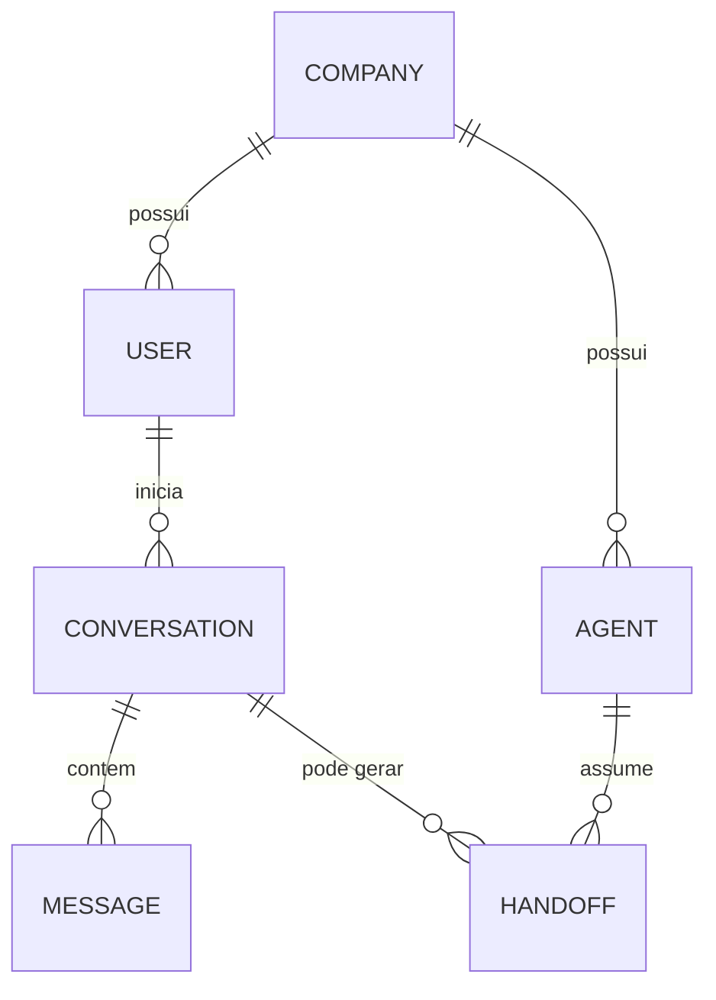

# Modelagem inicial de dados (planejamento, não implementado)

> **Status:** nada disto existe como código ainda — nenhuma entidade JPA foi
> criada no backend. Este documento existe só para registrar o raciocínio
> por trás da estrutura de pastas e decisões futuras, conforme pedido na
> atividade da Semana 05 ("pense desde já em uma arquitetura que possa
> futuramente possuir..."). Vira código nas próximas semanas, à medida que
> as funcionalidades do dashboard forem validadas com a WXN.

## Entidades previstas

- **Company** — empresa cliente da WXN (a solução é multi-tenant: cada
  empresa terá seus próprios usuários, atendentes e indicadores isolados).
- **User** — usuário final que conversa com o chatbot (cliente da empresa).
- **Conversation** — uma sessão de atendimento de um `User`, com um status
  (fila da IA, aguardando humano, resolvida etc. — ver o "Levantamento
  preliminar das funcionalidades do dashboard" e a atividade anterior de UX).
- **Message** — cada mensagem trocada dentro de uma `Conversation`.
- **Agent** — atendente humano de uma `Company`, que pode assumir uma
  `Conversation` depois de um handoff.
- **Handoff** — registro do evento de transferência de uma `Conversation` da
  IA para um `Agent` (e, eventualmente, de volta para a IA).

## Relacionamentos (visão conceitual)

- Uma `Company` tem vários `User` e vários `Agent`.
- Um `User` pode iniciar várias `Conversation` ao longo do tempo.
- Uma `Conversation` tem várias `Message`.
- Uma `Conversation` pode gerar um ou mais `Handoff` (ex.: IA → humano, e
  depois humano → IA de novo), cada um associado a um `Agent`.

## Por que não implementar isso já

O objetivo da Semana 05 é a fundação técnica (repositório, ambiente,
"esqueleto" do backend e frontend conversando entre si), não o domínio do
chatbot. Criar as seis entidades agora, sem regra de negócio nenhuma rodando
por cima, adicionaria tabelas vazias e código para manter sem gerar valor
real ainda — e a maioria dessas funcionalidades (fila de conversas,
histórico, transferência) ainda são hipóteses preliminares que precisam ser
validadas com a WXN antes de virar schema (ver seção 6 do "Levantamento
Técnico – Sistema Conversacional WXN", "itens a validar com a WXN").

Quando a modelagem começar a virar código, o caminho natural é:

1. Criar as entidades em `backend/.../model` (ou `entity`) uma de cada vez,
   conforme a funcionalidade correspondente for implementada.
2. Trocar `spring.jpa.hibernate.ddl-auto=update` por uma ferramenta de
   migration versionada (ex.: Flyway), para o schema parar de depender de
   o Hibernate inferir as tabelas.
3. Rever este diagrama à luz do que for confirmado com a WXN (permissões,
   dados sensíveis, retenção de histórico — ver as perguntas listadas no
   Levantamento Técnico).
